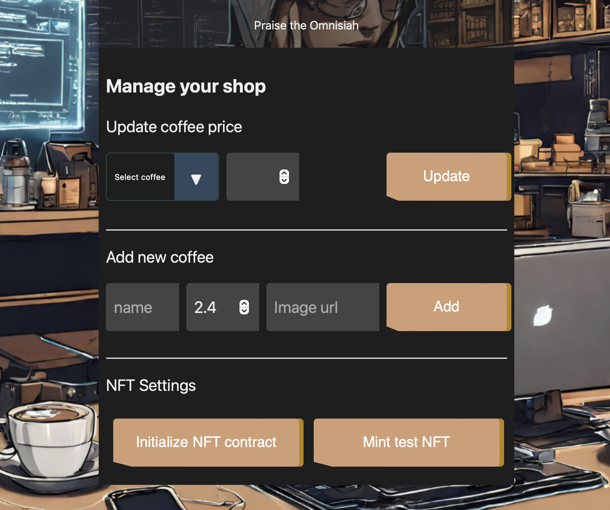
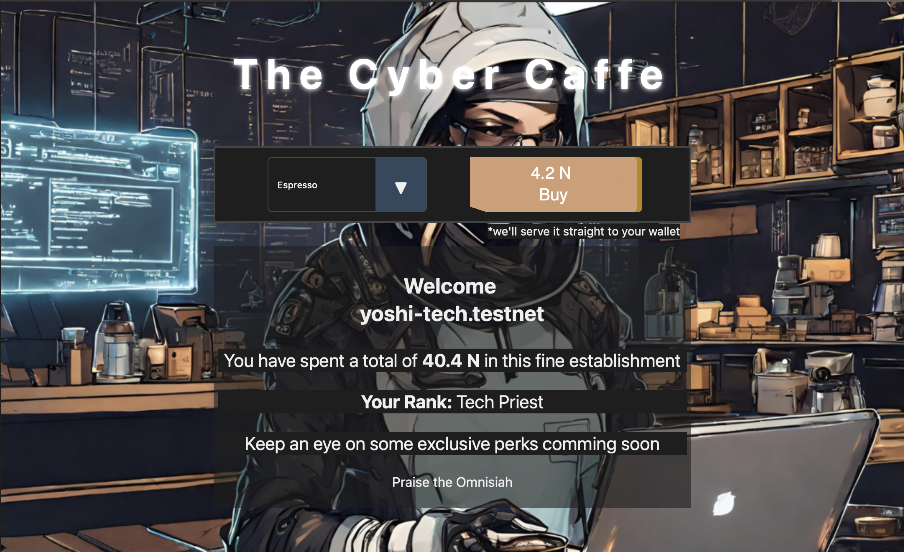
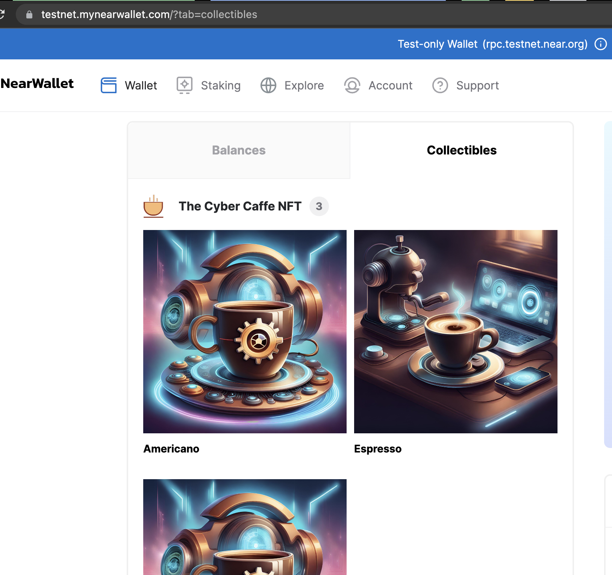

[The Cyber Caffe](https://cyber.yoshi.tech)
=================

Home of the best digital brew on NEAR blockchain.

The Cyber Caffe consists of 3 components:
- main contract (lib.rs)
- nft contract (https://github.com/ivanciric/cynt-nft.git, which is just personalized https://github.com/near-examples/NFT)
- frontend (vanilla js)

Its main purpose is to demonstrate some of the key concepts in NEAR app/smart contract development
- view functions
- call functions
- payable functions
- cross-contract calls
- storage
- transfers
- testing

The Story
=========
In the neon-lit streets of NeoTokyo, the year was 2057, and the world had evolved into a swirling blend of humanity and technology. Cyborgs with metallic limbs and neural enhancements strolled alongside makers with vivid augmented reality visors and holographic gloves. Amidst this chaotic future, there was one place that both these groups converged: The Cyber Café.

The Cyber Café was a hub for cybernetic enthusiasts, makers, and tech-savvy individuals who sought refuge from the digital grind. Located at the heart of the city, it was adorned with holographic advertisements for the latest tech gear and cyber enhancements. Inside, the atmosphere was an amalgamation of old-world charm and futuristic aesthetics. Neon lights intertwined with steampunk-inspired decor, giving the café a unique and inviting vibe.

A group of regulars had gathered that evening, their cybernetic enhancements and glowing implants reflecting the cafe's vibrant ambiance. Among them were Jack, a rugged, tech-savvy maker with an affinity for custom-built drones, and Eva, a cyborg with enhanced neural implants that made her a coding genius. They had formed an unlikely friendship, united by their shared passion for innovation.

As Jack and Eva settled into their usual corner booth, they ordered their favorite "Digital Brew" coffee, a specialty at The Cyber Café. The coffee was more than just a beverage; it was a data-rich experience, a blend of complex flavors and digital textures that could only be appreciated in a cyberpunk future. The menu was displayed on their augmented reality visors, and a few taps confirmed their order. As they finalized the purchase, a special NFT was delivered straight to their cryptographic wallets.

The coffee wasn't the only reason Jack and Eva frequented the café. They came for the unique offering that set The Cyber Café apart from other cyber cafes - NFTs. The café's coffee was brewed by an AI-driven process, and with every purchase, customers received NFTs of various strengths. These NFTs were digital tokens representing different aspects of the brewing process, from the blend's origin to its preparation techniques.

The patrons collected these NFTs avidly, not just as collectibles but for their mysterious potential. Nobody was entirely sure what they could be used for, but rumors swirled about their hidden capabilities. Some said they could unlock secret recipes for enhanced cybernetic implants, while others believed they could grant access to exclusive, hidden layers of the metaverse.

As Jack and Eva sipped their Digital Brew, they began to swap and trade their NFTs. Jack had collected a rare NFT representing the exotic origin of the coffee beans, and Eva had a few that hinted at advanced cybernetic enhancements. They connected their neural interfaces and initiated a trade, the data flowing seamlessly between them in a matter of seconds. A sense of anticipation filled the air as the transaction was confirmed.

Their NFT collection continued to grow, and with each one acquired, the possibilities of what they could unlock in this ever-evolving world expanded. In the heart of NeoTokyo, at The Cyber Café, makers and cyborgs met to not only enjoy the most unique coffee blend in the world but also to unravel the hidden potential of the digital NFTs they collected with each sip.

As the night deepened, they shared stories, dreams, and theories about the future. They were determined to uncover the true potential of their NFTs, convinced that these tokens held the key to something bigger than they could imagine. In the neon-lit heart of NeoTokyo, the future was uncertain, but with their ingenuity, curiosity, and a cup of Digital Brew in hand, they were ready to face it head-on.

The Screens
===========

The Setup
=========
1. Create a testnet account for the NFT contract to be deployed to, and deploy it: https://github.com/ivanciric/cynt-nft/blob/master/non_fungible_token.wasm
Take a note of that account, as we will need it for cross-contract calls from the main contract.

2. Edit the main contract (this repo, lib.rs) and enter your data:
Set the NFT contract account id (the one you deployed in step 1)
- `pub const NFT_CONTRACT: &str = "nft_contract.testnet";`

Set the shop owner. This is not the contract deployer. It is your special personal account you want receive payments to.
Percentage of each sale goes to this account.
- `pub const SHOP_OWNER: &str = "shop_owner.testnet";`

Set the percentage of the sales that the shop owner will receive.
- `pub const OWNER_FEE_PERCENT: i32 = 50;`

3. Build the entire app (contracts and fe).
- `npm run build`

4. Deploy the contract.
- `npm run deploy`

5. Start the dev server.
- `npm run start`

6. Login with NEAR using your `SHOP_OWNER` account.

7. You will automaticaly see your shop management. Click on the `Populate menu` button.
This will add sone coffee data, both for menu and creating nfts latter.

8. Next, we need to init the NFT contract and set our app(contract) as owner, so that we could actually mint NFTs.
Click on the `Initialize NFT contract` button.

9. After this, feel free to click the `Mint test NFT` button to test the actual minting.
Check you wallet Collectibles after a few moments to see the coffee nft.

10. Log out of the app, and login as some other testnet account (basically as a regular user).
You will be greated with a coffee menu and some additional info about your total spenditure in the app and your rank.

11. Choose your drink and buy it. You will receive a cyber coffee NFT with specific strength based on your rank, in your wallet shortly.

The Future
==========
- integration tests
- elaborate ranking system
- extra nft attributes
- social aspect between users
- actual frontend :)

This app was initialy created with [create-near-app] cli tool.

Links
===============

   
    [The Cyber Caffe]: https://cyber.yoshi.tech

    [create-near-app]: https://github.com/near/create-near-app
    [Node.js]: https://nodejs.org/en/download/package-manager/
    [jest]: https://jestjs.io/
    [NEAR accounts]: https://docs.near.org/concepts/basics/account
    [NEAR Wallet]: https://wallet.testnet.near.org/
    [near-cli]: https://github.com/near/near-cli
    [gh-pages]: https://github.com/tschaub/gh-pages
